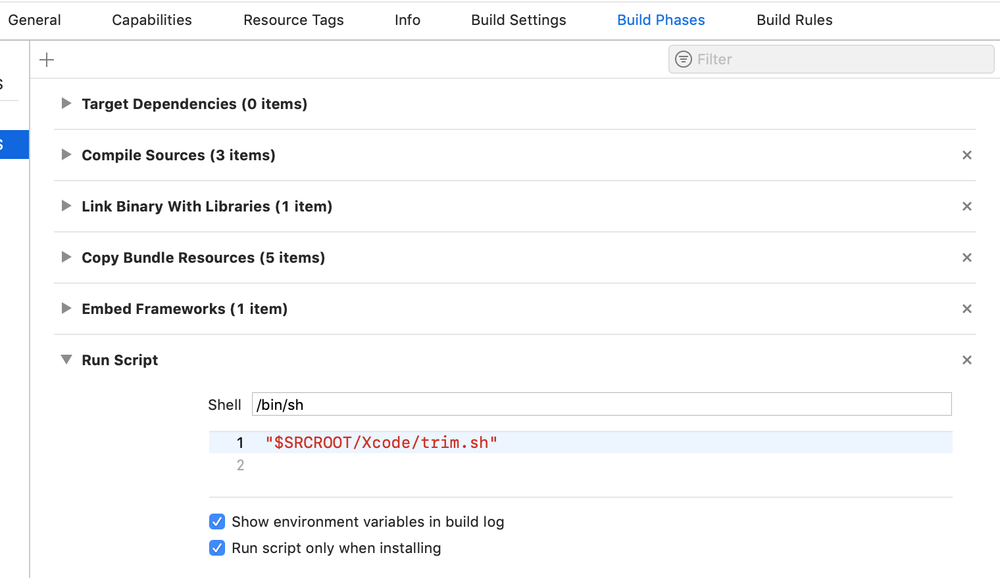
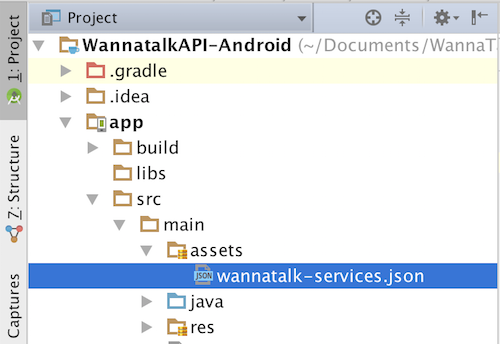

# react-native-wannatalk-core

## Getting started

`$ npm install react-native-wannatalk-core --save`

### Mostly automatic installation

`$ react-native link react-native-wannatalk-core`


## iOS Setup
1. Request **WTService-Info.plist** from [wannatalk.ai](https://wannatalk.ai) and drag it into your application. When prompted, select **"Copy items if needed"** and continue.
2. Add below keys in your application's Info.plist

    ```
   <key>NSPhotoLibraryUsageDescription</key>
   <string>To save in-chat photos and videos</string>
   <key>NSContactsUsageDescription</key>
   <string>To locate friends already on the Wannatalk network</string>
   <key>NSCameraUsageDescription</key>
   <string>To take photos and videos to send to friends in-chat</string>
   <key>NSLocationWhenInUseUsageDescription</key>
   <string>To display it in map</string>
   <key>NSMicrophoneUsageDescription</key>
   <string>To record live photos and movies</string>
   ```
3. Add this line to your pod file

    `pod 'WTExternalSDK', :git =>'https://github.com/edzehoo/WannatalkAPI-iOS.git', :tag => '1.5.1'`

4. `$ cd ios && pod install && cd ..`

5. `$ react-native run-ios`

## To strip simulator architecture framework for your app submission
1. Copy **trim.sh** file into your project folder.
2. Create Run Script Phase in Build Phases of your application target.
3. Paste `"$SRCROOT/trim.sh"` inside the body of Run Script Phase.
4. Enable `Run script only when installing` and `Show environment variables in build log`.


## Android Setup
1. Request **wannatalk-services.json** from [wannatalk.ai](https://wannatalk.ai) and drag it into your application `assets` directory


2. Set `compileOptions` in your application **build.gradle**

```
android {
    compileOptions {
        sourceCompatibility JavaVersion.VERSION_1_8
        targetCompatibility JavaVersion.VERSION_1_8
    }

    ...
}
```

3. Enable `multiDexEnabled` in your application **build.gradle**
   
   ```
   android {
       defaultConfig {
           // Enabling multidex support.
           multiDexEnabled true
       }
       ...
   }
   ```
4. Set colorPrimary, colorPrimaryDark and colorAccent attributes in app's color.xml (src/main/res/values/colors.xml)
5. `$ react-native run-android`


# Usage
```javascript
import WannatalkCore from 'react-native-wannatalk-core';
import { NativeEventEmitter, NativeModules } from 'react-native'

const WannatalkCoreEmitter = new NativeEventEmitter(WannatalkCore)
```


## To link Wannatalk account
```javascript
WannatalkCore.silentLogin("<user_identifier>", { displayname: "name", key1: "Value1", key2: "Value2"}, (success, error) => {
});
```

### Login events
```javascript
componentDidMount() {
  this.loginSubscription = WannatalkCoreEmitter.addListener('login-event', (data) =>  {
    // this.setState({loggedIn: data.userLoggedIn});  
  })
}
```
### To check login status
```javascript
WannatalkCore.isUserLoggedIn((userLoggedIn) => {
  // this.setState({loggedIn: data.userLoggedIn});  
})
```

## To unlink Wannatalk account
```javascript
WannatalkCore.logout((success, error) => {
});
```
    
## HelpDesk
### To load your organization profile
```javascript
WannatalkCore.loadOrganizationProfile(true, (success, error) => {
});
```

## Collaboration
### To view all chats
```javascript
WannatalkCore.loadChatList(, (success, error) => {
});
```
    
### To view all users
```javascript
WannatalkCore.loadUsers(, (success, error) => {
});
```

## Other

### To show or hide guide button
```javascript
WannatalkCore.ShowGuideButton(true); // default = true
```
### To enable or disable sending audio message
```javascript
WannatalkCore.AllowSendAudioMessage(false);  // default = YES
```
### To show or hide add participants option in new ticket page and chat item profile page
```javascript
WannatalkCore.AllowAddParticipants(false);    // default = YES
```
### To show or hide remove participants option in chat item profile
```javascript
WannatalkCore.AllowRemoveParticipants(false); // default = NO
```
### To show or hide welcome message
```javascript
WannatalkCore.ShowWelcomeMessage(false);            // default = NO
```
### To show or hide Profile Info page
```javascript
WannatalkCore.ShowProfileInfoPage(false);           // default = YES
```
### To create auto tickets: 
Chat ticket will create automatically when auto tickets is enabled, otherwise default ticket creation page will popup
```javascript
WannatalkCore.EnableAutoTickets(true);           // default = NO
```
### To show or hide close chat button in chat page
```javascript
WannatalkCore.ShowExitButton(true);               // default = NO
```
### To show or hide participants in chat profile page
```javascript
WannatalkCore.ShowChatParticipants(false);          // default = YES
```
### To enable or disbale chat profile page
```javascript
WannatalkCore.EnableChatProfile(false);           // default = YES
```
### To allow modify in chat profile page
```javascript
WannatalkCore.AllowModifyChatProfile(false);       // default = YES
```
### To set Inactive chat timeout:  
Chat session will end if user is inactive for timeout interval duration. If timeout interval is 0, chat session will not end automatically. The default timout interval is 1800 seconds (30 minutes).
```javascript
let timeoutInterval = 1800; // Default Value: 1800 seconds ~ 30 minutes
WannatalkCore.SetInactiveChatTimeoutInterval(timeoutInterval);
```
